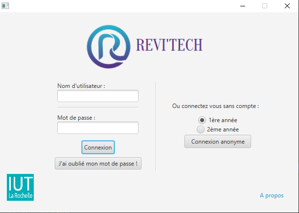

Projet Tutoré Semestre 2 - DUT Informatique La Rochelle - Année 2017-2018

## Présentation du projet :

Pour le projet tutoré du semestre 2, nous avons été sollicités par un professeur du département Technique de Commercialisation pour développer une application d’éphéméride permettant aux étudiants de sa promotion de réviser d’une manière plus ludique et donnant envie.

## Contenu du GitHub :
- Code source
- Documentation sur le code (`/docs`)